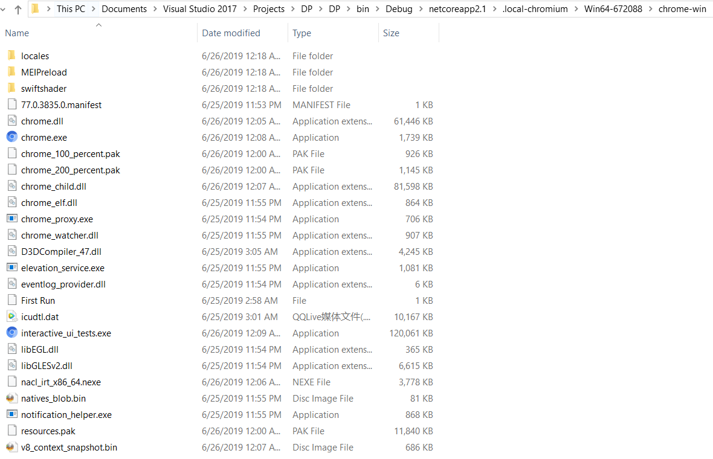

# Puppeteer Sharp

[Puppeteer](https://github.com/GoogleChrome/puppeteer) is a Node library which provides a high-level API to control Chrome or Chromium over the [DevTools Protocol](https://chromedevtools.github.io/devtools-protocol/). Puppeteer runs **headless by default**, but can be configured to run full (non-headless) Chrome or Chromium.

[Puppeteer Sharp](https://github.com/kblok/puppeteer-sharp) is a .NET port of the official Node.JS Puppeteer API.

PuppeteerSharp 已放上 [NuGet](https://www.nuget.org/packages/PuppeteerSharp/), .NETStandard 2.0

程序会自动下载Chromium

    await new BrowserFetcher().DownloadAsync(BrowserFetcher.DefaultRevision);

通过阅读源码，得到下载链接是:

    https://storage.googleapis.com/chromium-browser-snapshots/Win_x64/672088/chrome-win.zip

可以自行下载到

下载后解压，目录结构如下

### 参考:

> [C# 整合 Headless Chrome 的好工具 - Puppeteer Sharp](https://blog.darkthread.net/blog/puppeteer-sharp/)

> [download large file with httpclient](https://github.com/dotnet/corefx/issues/6849)

> [progress-reporting-for-httpclient-download](https://stackoverflow.com/questions/21169573/how-to-implement-progress-reporting-for-portable-httpclient)

> [html agility pack](https://html-agility-pack.net/?z=codeplex)