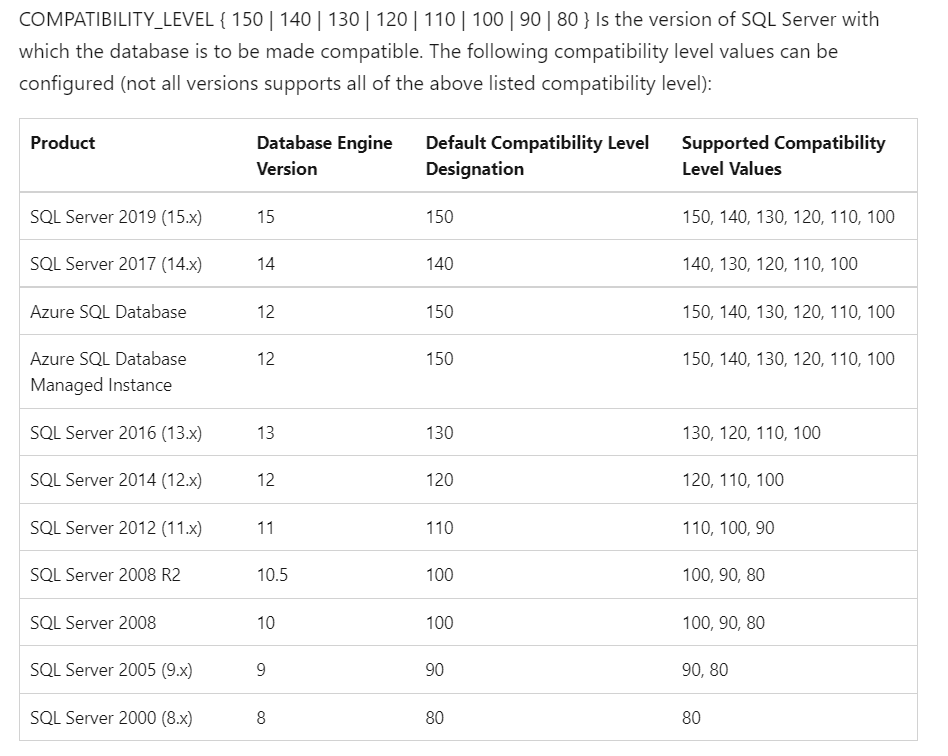

## STRING_SPLIT

A table-valued function that splits a string into rows of substrings, based on a specified separator character.

### Compatibility level 130
STRING_SPLIT requires the compatibility level to be at least 130. When the level is less than 130, SQL Server is unable to find the STRING_SPLIT function.

### How to get the compatibility level of the database

    SELECT compatibility_level  
    FROM sys.databases WHERE name = @DatabaseName;  

### Compatibility level corresponding to SQL Server version

