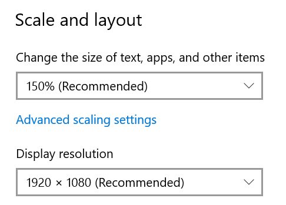
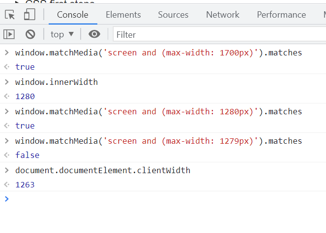

# Using media queries

## My Story

I got a new computer has the resolution 1920x1080, it is installed windows system and change the size of text, apps, and other items 150% in Display Settings. See below:

In my browser, when applying css `@media screen and (max-width: 1700)`, how to know the screen match the `media` query.

We can use `window.matchMedia('screen and (max-width: 1700px)').matches` to check it. See below:

`window.innerWidth` include the scrollbar width
`document.documentElement.clientWidth` doesn't include the scrollbar width

From above image, we can get the result:
`media` query `width` is compare with `window.innerWidth`.

> [matchMedia](https://developer.mozilla.org/en-US/docs/Web/API/Window/matchMedia)

> [how-to-get-the-browser-viewport-dimensions](https://stackoverflow.com/questions/1248081/how-to-get-the-browser-viewport-dimensions)

## @media vs @media screen

`screen` is one of the media types

Default media type is `all`

There are four media types, they are `all, print, screen, speech`.

> [Using_media_queries](https://developer.mozilla.org/en-US/docs/Web/CSS/Media_Queries/Using_media_queries)
> [media-all-vs-media-screen](https://stackoverflow.com/questions/12549267/media-all-vs-media-screen)

## Put this meta tag in your html head:

    <meta name="viewport" content="width=device-width, minimum-scale=1.0, maximum-scale=1.0" />

1. Here is an example of a max-width query.

        @media only screen and (max-width: 600px)  {...}

    What this query really means, is “If [device width] is **less than or equal** to 600px, then do {…}”

2. Here is an example of a min-width query.

        @media only screen and (min-width: 600px)  {...}

    What this query really means, is “If [device width] is **greater than or equal** to 600px, then do {…}”

Test Code:

    <html>
    <head>
    <meta name="viewport" content="width=device-width, minimum-scale=1.0, maximum-scale=1.0" />
    
    
    </head>
    <body>
    <form method="get" id="formtest">
    <input type="text" name="name" placeholder="Please input your name">
    <input type="button" onclick="cc();" value="search-button" class="visible-desktop">
    <input type="submit" onclick="cc();" value="search-submit" class="visible-mobile">
    </form>
    </body>
    </html>

> [min-width_and_max-width](https://www.emailonacid.com/blog/article/email-development/emailology_media_queries_demystified_min-width_and_max-width/)

>[Using media queries](https://developer.mozilla.org/en-US/docs/Web/CSS/Media_Queries/Using_media_queries)

> [what-is-the-difference-between-screen-and-only-screen-in-media-queries](https://stackoverflow.com/questions/8549529/what-is-the-difference-between-screen-and-only-screen-in-media-queries)

