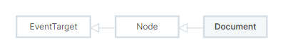
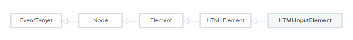

# HTML: HyperText Markup Language

HTML (HyperText Markup Language) is the most basic building block of the Web. It defines the meaning and structure of web content. 

"Hypertext" refers to links that connect web pages to one another, either within a single website or between websites.

# HTML attribute reference

Elements in HTML have attributes; these are additional values that configure the elements or adjust their behavior in various ways to meet the criteria the users want.

# Boolean Attributes

Some content attributes (e.g. `required`, `readonly`, `disabled`) are called boolean attributes. If a boolean attribute is present, its value is true, and if it's absent, its value is false.

> [boolean_attributes](https://developer.mozilla.org/en-US/docs/Web/HTML/Attributes#boolean_attributes)

# DOM (Document Object Model)

The DOM (Document Object Model) is an API that represents and interacts with any HTML or XML document. The DOM is a document model loaded in the browser and representing the document as a node tree, where each node represents part of the document (e.g. an element, text string, or comment).

The DOM is one of the most-used APIs on the Web because it allows code running in a browser to access and interact with every node in the document. Nodes can be created, moved and changed. Event listeners can be added to nodes and triggered on occurrence of a given event.

DOM was not originally specified, it came about when browsers began implementing JavaScript.

# Document
The Document interface represents any web page loaded in the browser and serves as an entry point into the web page's content, which is the DOM tree.

# HTMLInputElement.disabled

The `HTMLInputElement` interface provides special properties and methods for manipulating the options, layout, and presentation of `<input>` elements.

The `HTMLInputElement.disabled` is a boolean value that **reflects** the disabled HTML attribute, which indicates whether the control is disabled.