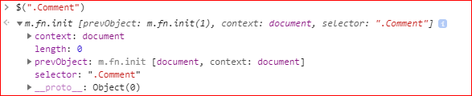
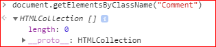
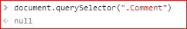
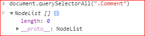

# Selector

## id property ends with "-token"

    $("[id$='-token']")

## id property starts with "edit"

    $("[id^=edit]")

## id property contains "edit"    
    
    $("[id*='edit']")

## multiple selector

[multiple-attribute-selector](https://api.jquery.com/multiple-attribute-selector/)

## selector return value

如果页面没有class="Comment"的元素.

* $(".Comment")返回什么? 

> [class-selector](https://api.jquery.com/class-selector/)    

* document.getElementsByClassName("Comment")返回什么?  

        

* document.querySelector(".Comment")返回什么?

        

* document.querySelectorAll(".Comment")返回什么?

  

    
