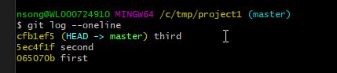
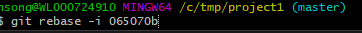
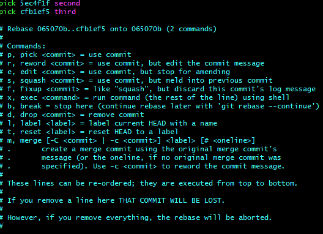
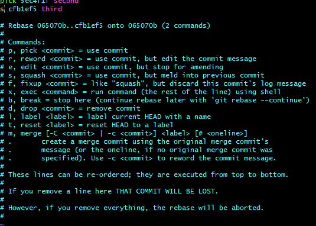
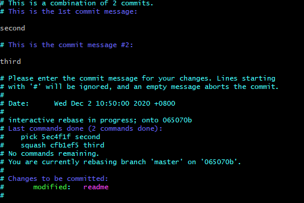
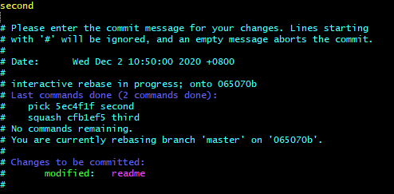
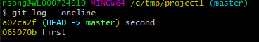

### Simple Rebase

1.1 `git log --oneline`

1.2 如果你想rebase seond和third提交，你需要 git rebase -i "seond的前一个提交"

**NOTE:** 如果想要合并 `065070b` 和 `5ec4f1f`， 需要 `git rebase -i --root`

1.3 `git rebase`后，会有一个页面显示可以操作的提交，提交是按照提交时间由小到大排序的

1.4 需要合并 `cfb1ef5` 这个提交到 `5ec4f1f`， 把 `cfb1ef5` 前的 `pick` 改为 `s`，然后保存

1.5 接着会需要给这次操作（这个操作会生成一个commit）提供一个message

1.6 修改好后保存

1.7 查看新的`git log --oneline`

