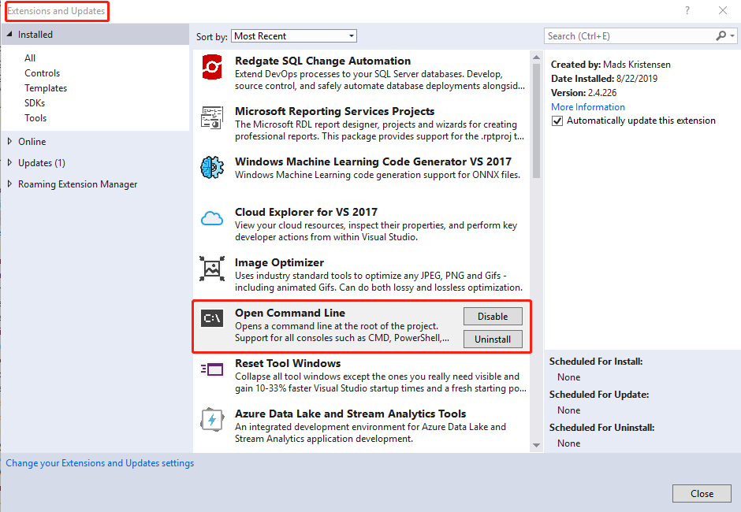
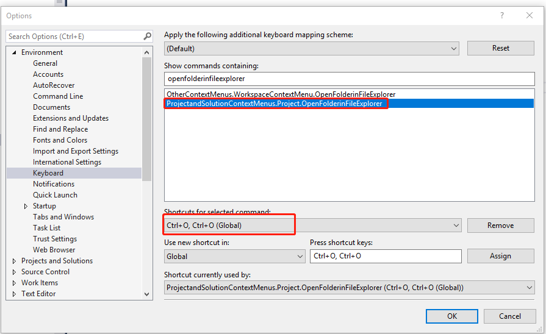
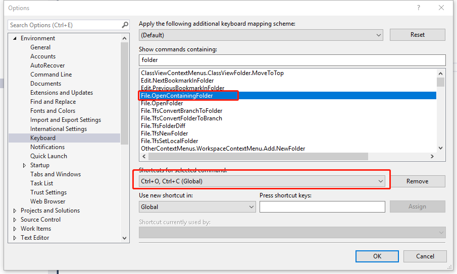
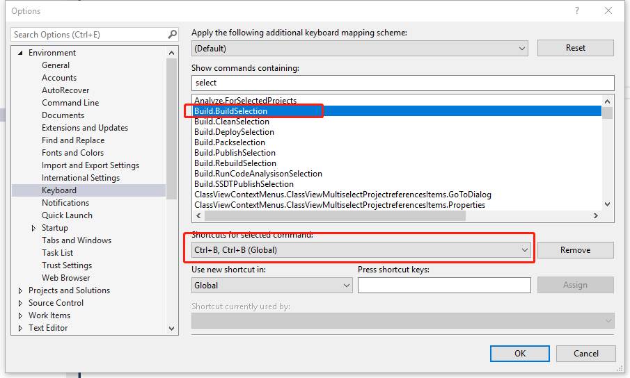

# Key

1. find recently file

    Ctrl+T o

2. select current cursor word

    Ctrl+w

3. go to next selected word

    Ctrl+F3

4. select and change batch

    Ctrl+Shift+. => select, then change

5. open command

    Alt+Space => open command

6. open folder

    Ctrl+O Ctrl+O

7. open container folder

    Ctrl+O Ctrl+C

7. build select project

    Ctrl+B Ctrl+B 

8. build solution

    Ctrl+Shift+B

9. compare two files

    VS->View->Other Windows->Command Window (Ctrl+Alt+A)

    Tools.DiffFiles File1 File2

10. [Go to Matching Brace](https://stackoverflow.com/questions/1501921/go-to-matching-brace-in-visual-studio)

    CTRL + ]

11. collapse all sections of code

    CTRL+M+O
