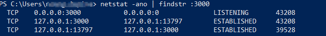

    Get-Process -Name "winword" | Select-String -Pattern Id

    Stop-Process -Name "winword"

    Stop-Process -Name "iexplore"

    Add-Content -Path 'C:\log.txt' -Value 'test string'

    Write-Host 'Hello, World!'

    try { NonsenseString }
    catch { Write-Host "error: " + $_ }

    Get-Process | Select-String -Pattern sky

    netstat -ano | findstr :3000

    taskkill /f /pid  43208

    

[authenticodesignature](https://docs.microsoft.com/en-us/powershell/module/microsoft.powershell.security/set-authenticodesignature)