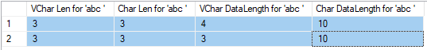

# SQL Server Compare

    create table #tmp(c1 varchar(10), c2 char(10))
    GO
    insert into #tmp values ('abc ', 'abc ')
    insert into #tmp values ('abc', 'abc')
    GO
    select len(c1) as 'VChar Len for ''abc ''', len(c2) as 'Char Len for ''abc ''', datalength(c1) as 'VChar DataLength for ''abc ''', datalength(c2) as 'Char DataLength for ''abc ''' from #tmp
    GO
    drop table #tmp

    

> [How SQL Server compares strings with trailing spaces](https://support.microsoft.com/en-us/help/316626/inf-how-sql-server-compares-strings-with-trailing-spaces)

> [DATALENGTH](https://docs.microsoft.com/en-us/sql/t-sql/functions/datalength-transact-sql)

> [LEN](https://docs.microsoft.com/en-us/sql/t-sql/functions/len-transact-sql)

