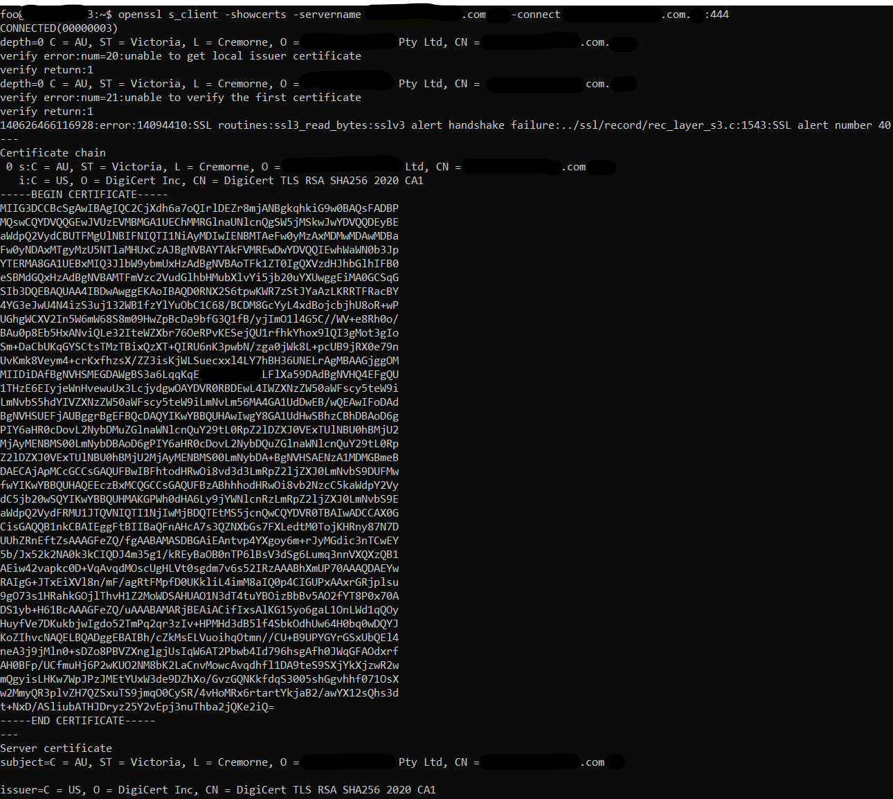

## Check the domain certificate

    openssl s_client -showcerts -servername xxx.com -connect xxx.com:444

### example:

    openssl s_client -showcerts -servername www.amazon.com -connect www.amazon.com:443

### no client certificate example:

  
## Get the certificate expiry date

    openssl s_client -showcerts -servername xxx.com -connect xxx.com:444 | openssl x509 -noout -dates
  
### example:

    openssl s_client -showcerts -servername www.amazon.com -connect www.amazon.com:443 | openssl x509 -noout -dates
