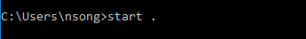
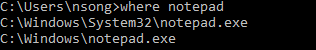

## open folder 

## find program 

## Open Environment Variables in Windows 10?
   
1. `Win+R` to open `Run window` 
2. Enter `sysdm.cpl` to open `System Properties`
3. Use the path `Advanced->Environment Variables`    

## How can you find out which process is listening on a port on Windows?

	C:\> netstat -a -b

## Restart IIS (run as administrator)

	iisreset 

## open windows Startup folder 

1. `Windows logo key + R`
2. type `shell:startup`, then select OK.